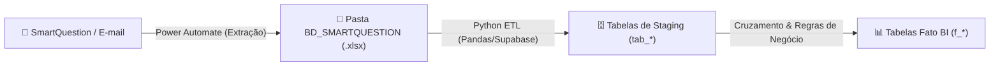

# 🚀 lr-smartquestion

> Repositório oficial de Analytics da Labor Rural para automação de extração, tratamento, unificação e carga de relatórios do **SmartQuestion** (Vínculos, Inativação, Visitas, Grupos de Atendimento) para o banco de dados Supabase e apoio aos dashboards de BI.

---

## 📋 Sobre o Projeto

O **SmartQuestion** (https://laborrural.smartquestion.com.br/) é a plataforma de campo utilizada pelos consultores da Labor Rural para acompanhamento e coleta de dados zootécnicos e econômicos nas fazendas.

Este projeto centraliza o pipeline de ETL:
1. **Ingestão/Leitura**: Leitura automatizada dos relatórios em Excel exportados do SmartQuestion (Vínculos, Inativação, Visitas dos Projetos, Grupos).
2. **Tratamento & Consistência**: Cruzamento com dados de produtores ativos, cálculo de visitas realizadas vs. esperadas, e higienização de nomes e códigos.
3. **Carga & Histórico**: Carga incremental/empilhada no Supabase (`tab_vinculos_sq`, `tab_visitas_sq`, `f_visitas_bi_lr`, `f_movimentacao_produtores_bi_lr`, `f_consistente_bi_lr`).
4. **Alimentação de BI**: Disponibilização das visões tratadas para o Power BI e Dashboards de sala.

---

## 🔄 Arquitetura do Encadeamento Completo



---

## 🗺️ Mapeamento Detalhado: Fluxos do Automate vs. Arquivos vs. Scripts ETL

### 1. 🚜 Extração de Visitas de Campo por Projeto
Os fluxos de projetos específicos extraem relatórios operacionais enviados periodicamente pelo SmartQuestion para a pasta local `BD_SMARTQUESTION`.

* **[SMARTQUESTION] Extração LPA**
  * 📄 **Arquivo Gerado:** `LISTA_LPA_VISITA.xlsx`
  * 🐍 **Módulo Python (ETL):** `processar_relatorios_visitas()` e `etl_visitas()` em `ETL_BI_LR.ipynb`
  * 🗄️ **Tabela Origem Supabase:** `tab_visitas_sq`
  * 📊 **Destino no BI:** `f_visitas_bi_lr`

* **[SMARTQUESTION] Extração CCPR**
  * 📄 **Arquivo Gerado:** `LISTA_CCPR_VISITA.xlsx`
  * 🐍 **Módulo Python (ETL):** `processar_relatorios_visitas()` e `etl_visitas()` em `ETL_BI_LR.ipynb`
  * 🗄️ **Tabela Origem Supabase:** `tab_visitas_sq`
  * 📊 **Destino no BI:** `f_visitas_bi_lr`

* **[SMARTQUESTION] Extração Semear**
  * 📄 **Arquivo Gerado:** `LISTA_SEMEAR_VISITA.xlsx`
  * 🐍 **Módulo Python (ETL):** `processar_relatorios_visitas()` e `etl_visitas()` em `ETL_BI_LR.ipynb`
  * 🗄️ **Tabela Origem Supabase:** `sq_raw_visitas`
  * 📊 **Destino no BI:** `sq_fato_visitas`

* **[SMARTQUESTION] Extração Alvoar**
  * 📄 **Arquivo Gerado:** `LISTA_ALVOAR_VISITA.xlsx`
  * 🐍 **Módulo Python (ETL):** `processar_relatorios_visitas()` e `etl_visitas()` em `ETL_BI_LR.ipynb`
  * 🗄️ **Tabela Origem Supabase:** `sq_raw_visitas`
  * 📊 **Destino no BI:** `sq_fato_visitas`

* **[SMARTQUESTION] Extração Regenera**
  * 📄 **Arquivo Gerado:** `LISTA_REGENERA_VISITA.xlsx`
  * 🐍 **Módulo Python (ETL):** `processar_relatorios_visitas()` e `etl_visitas()` em `ETL_BI_LR.ipynb`
  * 🗄️ **Tabela Origem Supabase:** `sq_raw_visitas`
  * 📊 **Destino no BI:** `sq_fato_visitas`

---

### 2. 📋 Extração Geral e Cadastro
* **[SMARTQUESTION] Extração Visitas (Geral)**
  * 📄 **Arquivo Gerado:** `LISTA_GERAL_VISITAS.xlsx`
  * 🐍 **Módulo Python (ETL):** `etl_visitas()` em `ETL_BI_LR.ipynb`
  * 🗄️ **Tabela Origem Supabase:** `sq_raw_visitas`

* **[SMARTQUESTION] Extração Grupo**
  * 📄 **Arquivo Gerado:** `LISTA_GERAL_RELATORIO_DE_GRUPO.xlsx`
  * 🐍 **Módulo Python (ETL):** Módulo de Grupos em `ETL_BI_LR.ipynb`
  * 🗄️ **Tabela Supabase:** `sq_raw_fazendas_grupo`

* **[SMARTQUESTION] Extração Vínculos**
  * 📄 **Arquivo Gerado:** `BD_BI_VINCULOS_COMPLETO.xlsx`
  * 🐍 **Módulo Python (ETL):** `etl_vinculos()` em `ETL_BI_LR.ipynb`
  * 🗄️ **Tabela Supabase:** `sq_raw_vinculos`
  * 📊 **Tabela Fato Impactada:** Cruza com `sq_fato_visitas` e `sq_fato_consistencia`

* **[SMARTQUESTION] Extração Cadastro**
  * 📄 **Arquivo Gerado:** `*LISTA_CADASTRO.xlsx`
  * 🐍 **Módulo Python (ETL):** Módulo de Cadastro em `ETL_BI_LR.ipynb`
  * 🗄️ **Tabela Supabase:** `sq_dim_fazendas_ativas`

* **[SMARTQUESTION] Extração Inativação**
  * 📄 **Arquivo Gerado:** `*LISTA_INATIVACAO.xlsx` (ex: `260807_LISTA_INATIVACAO.xlsx` e `BD_INATIVACAO_2023_2025.xlsx`)
  * 🐍 **Módulo Python (ETL):** `etl_inativacao()` e `etl_inativacao_consultor()` em `ETL_BI_LR.ipynb`
  * 🗄️ **Tabela Supabase:** `sq_raw_inativacoes_produtor` e `sq_raw_inativacoes_consultor`
  * 📊 **Tabela Fato Impactada:** `sq_fato_movimentacao` (Turnover / Saídas)

---

### 📋 Tabela Resumo de Mapeamento

| Fluxo Power Automate | Arquivo em `BD_SMARTQUESTION` | Função/Módulo Python | Tabela Supabase |
| :--- | :--- | :--- | :--- |
| `Extração LPA` | `LISTA_LPA_VISITA.xlsx` | `processar_relatorios_visitas()` / `etl_visitas()` | `sq_raw_visitas` |
| `Extração CCPR` | `LISTA_CCPR_VISITA.xlsx` | `processar_relatorios_visitas()` / `etl_visitas()` | `sq_raw_visitas` |
| `Extração Semear` | `LISTA_SEMEAR_VISITA.xlsx` | `processar_relatorios_visitas()` / `etl_visitas()` | `sq_raw_visitas` |
| `Extração Alvoar` | `LISTA_ALVOAR_VISITA.xlsx` | `processar_relatorios_visitas()` / `etl_visitas()` | `sq_raw_visitas` |
| `Extração Regenera` | `LISTA_REGENERA_VISITA.xlsx` | `processar_relatorios_visitas()` / `etl_visitas()` | `sq_raw_visitas` |
| `Extração Visitas` | `LISTA_GERAL_VISITAS.xlsx` | `etl_visitas()` | `sq_raw_visitas` |
| `Extração Grupo` | `LISTA_GERAL_RELATORIO_DE_GRUPO.xlsx` | Módulo de Grupos | `sq_raw_fazendas_grupo` |
| `Extração Vínculos` | `BD_BI_VINCULOS_COMPLETO.xlsx` | `etl_vinculos()` | `sq_raw_vinculos` |
| `Extração Cadastro` | `*LISTA_CADASTRO.xlsx` | Módulo de Cadastro | `sq_dim_fazendas_ativas` |
| `Extração Inativação` | `*LISTA_INATIVACAO.xlsx` | `etl_inativacao()` / `etl_inativacao_consultor()` | `sq_raw_inativacoes_produtor` |

---

## 📁 Estrutura do Repositório

```text
lr-smartquestion/
│
├── AGENTS.md                       # Regras oficiais do repositório (IA & Devs)
├── README.md                       # Documentação principal do projeto
├── .gitignore                      # Regras de exclusão Git
├── requirements.txt                # Dependências Python do projeto
│
├── dashboard/                      # 📺 Dashboard Web Vercel para TV (HTML/CSS/JS + Node Serverless)
│   ├── package.json                # Dependências Node (@supabase/supabase-js)
│   ├── vercel.json                 # Configurações de rotas e headers da Vercel
│   ├── start_kiosk.bat             # Atalho Windows para abrir o dashboard em modo Kiosk na TV
│   ├── public/                     # Frontend estático (HTML, CSS Dark Theme, JS Charts & Carousel)
│   └── api/                        # Serverless Functions (overview, visits, consistency, turnover)
│
├── db/                             # Banco de Dados local / Arquivos
│   ├── input/                      # Relatórios brutos exportados do SmartQuestion
│   └── output/                     # Saídas e arquivos gerados (processed, figures, html, logs)
│
└── scripts/                        # Scripts e Notebooks do Pipeline ETL
```

---

## 📺 Dashboard Web na Vercel (TV Kiosk)

O projeto contém uma aplicação web completa na pasta `dashboard/` para projeção síncrona na sala dos consultores (TV 55" Full HD).

### 🚀 Como Fazer Deploy na Vercel

1. **Instalar a CLI da Vercel**:
   ```bash
   npm install -g vercel
   ```

2. **Fazer o Deploy**:
   ```bash
   cd dashboard
   vercel
   ```

3. **Configurar as Variáveis de Ambiente na Vercel**:
   No painel da Vercel (Project Settings -> Environment Variables), adicione:
   - `SUPABASE_URL`: `https://mrjrkkbecjyzzwkvouxx.supabase.co`
   - `SUPABASE_SERVICE_KEY`: `sua-chave-do-supabase`

4. **Deploy em Produção**:
   ```bash
   vercel --prod
   ```

### 📺 Como Rodar na TV da Sala (Modo Kiosk)

Dê um duplo clique no arquivo `dashboard/start_kiosk.bat` para abrir o Google Chrome em tela cheia (modo Kiosk) apontando diretamente para a URL do dashboard na Vercel.

---

## ⚙️ Configuração do Ambiente

1. **Instalar dependências**:
   ```bash
   pip install -r requirements.txt
   ```

2. **Configurar variáveis de ambiente**:
   Copie `scripts/config/.env.example` para `scripts/config/.env` e preencha as credenciais do Supabase / SharePoint:
   ```env
   SUPABASE_URL=https://xxxx.supabase.co
   SUPABASE_SERVICE_KEY=xxxx
   ```

3. **Ajustar mês de referência**:
   Edite `scripts/config/config.yaml` para definir o mês de referência da análise:
   ```yaml
   referencia:
     mes_referencia: "2026-08-01"
   ```

---

## ▶️ Execução do Pipeline

Para executar o pipeline completo sequencialmente:
```bash
python scripts/executar_pipeline.py
```

Ou execute individualmente cada notebook na pasta `scripts/`.

---

## 👨‍💻 Autor

**Guilherme Henrique Fonseca Nogueira**
* **Labor Rural - Departamento Analytics**
