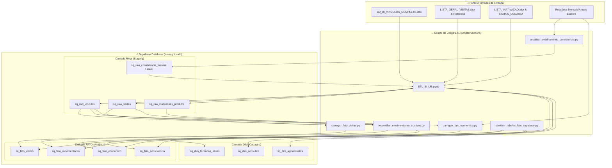

# 🗄️ Resumo Geral das Tabelas do Supabase (`lr-analytics-db`)

**Projeto**: BI Labor Rural — SmartQuestion & Elabore  
**Data da Documentação**: 22/09/2026  
**Banco de Dados Central**: Supabase (`lr-analytics-db` — Workspace LaborRural Interno)  

---

## 📐 1. Arquitetura e Taxonomia do Banco de Dados

De acordo com as **Regras Oficiais do Repositório (`AGENTS.md`)** e as diretrizes do **Labor Rural Database Standards**, todas as tabelas no Supabase seguem rigorosamente a estrutura taxonômica:

$$\text{Tabela} = \text{<prefixo\_projeto>}\_\text{<camada>}\_\text{<entidade>}$$

### 🔹 Prefixos de Projetos
- `sq_`: **SmartQuestion** (Gestão de visitas técnicas, vínculos, movimentação de produtores e consistência).
- `elabore_`: **Elabore** (Indicadores financeiros, custos operacionais e margem bruta).
- `pro_`: **Procampo** (Projetos específicos de agroindústrias parcerias).
- `meta_`: **Metas** (Metas operacionais e contratuais por projeto/consultor).

### 🔹 Camadas Analíticas
1. `raw`: Ingestão de dados brutos / staging a partir de planilhas operacionais em Excel.
2. `fato`: Tabelas fato analíticas agregadas com regras de negócio, reconciliação e higienização aplicadas.
3. `dim`: Tabelas de dimensão cadastral (produtores, fazendas, consultores, agroindústrias, regiões).
4. `base`: Snapshots temporais congelados mês a mês.

---

## 🔄 2. Origem dos Dados e Mapeamento de Pipeline (ETL)

Os dados no Supabase são alimentados por um pipeline automatizado em Python localizado em `scripts/executar_pipeline.py`. As fontes de dados primárias são divididas em duas grandes origens:

1. **SmartQuestion (Planilhas de Campo e Cadastro)**: Localizadas em `BD_SMARTQUESTION/`.
2. **Elabore (Relatórios Financeiros e Zootécnicos)**: Localizadas nas exportações do sistema Elabore (`monthly` e `annual`).

---

## 📊 3. Matriz Completa das Tabelas no Supabase

| Nome da Tabela | Camada | Descrição do Conteúdo | Origem Primária dos Dados | Script de Processamento / ETL | Chave Primária / Composta |
| :--- | :--- | :--- | :--- | :--- | :--- |
| `sq_raw_vinculos` | `raw` | Ingestão bruta dos vínculos técnicos entre consultores, produtores, fazendas e agroindústrias. | `BD_SMARTQUESTION/BD_BI_VINCULOS_COMPLETO.xlsx` | `scripts/ETL_BI_LR.ipynb` | `id_composto` |
| `sq_raw_visitas` | `raw` | Ingestão bruta de atendimentos/visitas técnicas e administrativas registradas em campo. | `BD_SMARTQUESTION/LISTA_GERAL_VISITAS.xlsx`, `LISTA_*_VISITA.xlsx` e backups | `scripts/ETL_BI_LR.ipynb` / `carregar_historico_visitas.py` | `id_atendimento` |
| `sq_raw_inativacoes_produtor` | `raw` | Solicitações e histórico bruto de inativação formal de produtores e fazendas. | `BD_SMARTQUESTION/*_LISTA_INATIVACAO.xlsx` | `scripts/ETL_BI_LR.ipynb` | `id_atendimento` |
| `sq_raw_inativacoes_consultor` | `raw` | Status cadastral, licenças e histórico de inativação da equipe de consultores. | `BD_SMARTQUESTION/BD_STATUS_USUARIO_SQ.xlsx` | `scripts/ETL_BI_LR.ipynb` | `id_consultor` / `email` |
| `sq_raw_consistencia_mensal` | `raw` | Ingestão mensal bruta dos lançamentos zootécnicos e financeiros do Elabore. | Diretório `monthly` do sistema Elabore | `scripts/functions/atualizar_detalhamento_consistencia.py` | `id_composto` |
| `sq_raw_consistencia_anual` | `raw` | Consolidados anuais brutos de consistência zootécnica e financeira. | Diretório `annual` do sistema Elabore | `scripts/functions/atualizar_detalhamento_consistencia.py` | `id_composto` |
| `sq_raw_fazendas_grupo` | `raw` | Ingestão bruta de relatórios de grupos de atendimento por projeto e regional. | `BD_SMARTQUESTION/LISTA_GERAL_RELATORIO_DE_GRUPO.xlsx` | `scripts/ETL_BI_LR.ipynb` | `codigo_lr` |
| `sq_fato_visitas` | `fato` | Visitas técnicas validadas e higienizadas (expurgando formulários de CFT e inativações). | Cruzamento de `sq_raw_visitas`, `sq_raw_vinculos` e regras de negócio | `scripts/functions/carregar_fato_visitas.py` | `id_atendimento` |
| `sq_fato_consistencia` | `fato` | Taxas e pontuações de consistência de entrega de dados pelos produtores/consultores. | Consolidação de `sq_raw_consistencia_mensal` e `sq_raw_consistencia_anual` | `scripts/functions/atualizar_consistencia_completa.py` | `id_composto` |
| `sq_fato_movimentacao` | `fato` | Entradas (cadastros), saídas (inativações), reativações e saldo mensal de produtores ativos. | Cruzamento dinâmico de `sq_raw_vinculos`, inativações e atendimentos | `scripts/functions/reconciliar_movimentacao_e_ativos.py` | `id_composto` (`codigo_lr` + `mes_referencia`) |
| `sq_fato_economico` | `fato` | KPIs de pecuária de leite (Volume de leite, Produtividade, Preço/L, COE Total e por Litro, Margem Bruta R$ e R$/L). | Relatórios de indicadores operacionais do Elabore + cadastros do SmartQuestion | `scripts/functions/carregar_fato_economico.py` | `id_composto` (`codigo_lr` + `mes_referencia`) |
| `sq_dim_fazendas_ativas` | `dim` | Snapshot cadastral consolidado das fazendas/produtores ativos mês a mês. | Reconciliação entre `sq_raw_vinculos`, relatórios de grupo e movimentação | `scripts/functions/reconciliar_movimentacao_e_ativos.py` | `id_composto` (`codigo_lr` + `mes_referencia`) |
| `sq_dim_consultor` | `dim` | Cadastro oficial de consultores com formação técnica, regional e status. | `BD_SMARTQUESTION/BD_STATUS_USUARIO_SQ.xlsx` | `scripts/ETL_BI_LR.ipynb` | `nome_consultor` |
| `sq_dim_agroindustria` | `dim` | Dimensão de agroindústrias / laticínios parceiros (Alvoar, CCPR, Nestlé, etc.). | Normalização de cadastros de `sq_raw_vinculos` e `config.yaml` | `scripts/ETL_BI_LR.ipynb` | `codigo_agroindustria` |
| `sq_dim_regiao` | `dim` | Dimensão regional de agrupamento geográfico de atendimento. | Normalização de relatórios de grupo e projetos | `scripts/ETL_BI_LR.ipynb` | `id_regiao` |

---

## 🛠️ 4. Regras Principais de Higienização e Tratamento de Dados

1. **Padronização de Códigos e IDs**:
   - `codigo_lr`: Formatado em maiúsculas, sem espaços laterais ou caracteres ocultos (`\xa0`).
   - `id_atendimento`: Convertido para string limpa sem sufixos decimais (ex: remove `.0`).
2. **Separação de Formulários Administrativos e Técnicos**:
   - Visitas do tipo CFT, termos de adesão, inativações e perfis leite padrão são expurgados da `sq_fato_visitas` e direcionados às tabelas de movimentação/inativação correspondentes.
3. **Persistência Incremental e Upsert**:
   - Todas as gravações no Supabase são realizadas via `.upsert()` utilizando o `id_composto` ou a chave primária da tabela para evitar duplicidade de registros.
4. **Tratamento de Mês de Referência**:
   - Mês de referência centralizado em `scripts/config/config.yaml` (`referencia.mes_referencia`), garantindo alinhamento temporal entre a API do Dashboard e o Supabase.

---

> ℹ️ *Documentação gerada automaticamente via pipeline de auditoria e conformidade técnica do repositório BI Labor Rural.*
